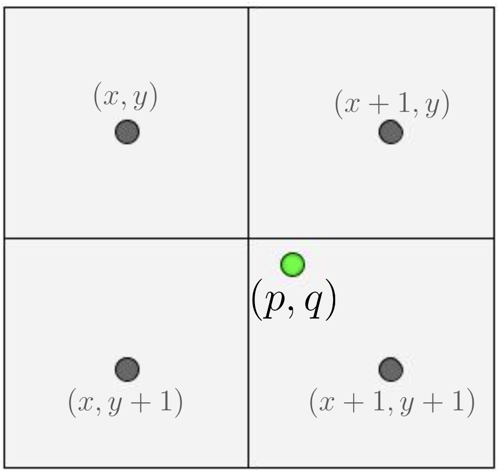

## CS 444: Deep Learning for Computer Vision, Fall 2024, Assignment 3

### Instructions

1. Assignment is due at **11:59:59 PM on Tuesday Nov 5 2024**.

2. See [policies](https://saurabhg.web.illinois.edu/teaching/cs444/fa2024/policies.html)
   on [class website](https://saurabhg.web.illinois.edu/teaching/cs444/fa2024).

3. Submission instructions:
    1. On gradescope assignment called `MP3-code`, upload the following 4 files:
        - Your completed `network.py` and `detection_utils.py`. We will run
          tests to evaluate your pytorch code for `compute_targets`,
          `compute_bbox_targets`, `apply_bbox_deltas`, `nms` and functions in
          the `Anchors` class.
        - Predictions from your trained RetinaNet (`results_test.json`) from
          Question 6.  See `predict.py` for code that generates the result
          file. We will benchmark your predictions and report back the average
          precision. Score will be based on the average precision
          of your predictions.
        - A single self-contained script called `script_full.py`that includes all 
          the code to train and test the model that produced the test set results 
          that you uploaded.
       
       Please also note the following points:
        - Do not compress the files into `.zip` as this will not work.
        - Do not change the provided files names nor the names of the functions
          but rather change the code inside the provided functions and add new
          functions. Also, make sure that the inputs and outputs of the
          provided functions are not changed.
        - The autograder will give you feedback on how well your code did.
        - The autograder is configured with the python libraries: `numpy
          absl-py tqdm torch pycocotools` only.

    2. On gradescope assignment called `MP3-report`, upload:
       - Visualization for Question 1.2
       - Training / validation plots and a description of what all you
         tried to get the detector to work and supporting control experiments.
         See Question 6 for more specific details.

4. Lastly, be careful not to work of a public fork of this repo. Make a private
   clone to work on your assignment. You are responsible for preventing other
   students from copying your work.

5. Change Log:
  - Released on Oct 18
  - Oct 23, we made some small logging fixes and added some command line arguments for easier code execution.
  - Oct 23: We have released leading curves for some runs as a reference, details can be found under section 6
  - Oct 23: We have also updated the Campus Cluster instructions with more details (For e.g. how to run tensorboard) and a best practices section. 


### Suggested Development Workflow

1. For questions 1 through 5, you can do your development on a local machine without a GPU.
2. For Q6, where you have to actually train the model, you will need to use a serious GPU for a few hours to train the model. We have arranged access to GPUs on the Campus Cluster for this purpose. See instructions here [doc](https://docs.google.com/document/d/1xdeSnUcaPfER2B7fE1SvcpbXQ8wKy-UBYreqLEzmw4w/edit?usp=sharing):
   - On the campus cluster, nominally your jobs will get executed with standard priority, but on the following dates (Oct 29 to Oct 31, and Nov 3 to Nov 5), you will have higher priority over other users and your jobs are likely to start running more promptly.
   - You should follow best practices in using the cluster (mentioned under section 5: **Campus Cluster Best Practices** in the instructions document), e.g. you should not request a job longer than 3 hours, should not queue more than 1 job at a time, not run anything on the root node etc. We (and the people who run the Campus Cluster) will be strictly monitoring usage patterns. Violating campus cluster policies may cause you to be banned from using it, and we will not be able to provide any help in that situation. So, please be careful.
   - If things go as planned, our calculations suggest that you should be able to get one 3 hour training run done per day on campus cluster. But please plan for additional time and don't wait till the last day to start traiing your models. 
   - You can also explore other training options as well, like [Kaggle](https://www.kaggle.com/code) and [Google Colab Pro](https://colab.research.google.com/signup). Your personal compute device may also have a decent enough GPU, check on that as well.
   

### Setup

   1. Install pre-requisites in `requirements.txt`
   2. **Download the dataset**: In this MP, we will be working with a subset of
      images from the [MS-COCO dataset](https://cocodataset.org/#home) containing
      10 different kinds of animals. The train, valid, and test splits contain
      5000, 1250, and 1250 images, respectively. If you are on a Unix-based
      system (macOS or Linux), you can run the following commands to download
      the dataset. If you are using Windows, you should manually download the
      dataset from
      [here](https://saurabhg.web.illinois.edu/teaching/cs444/fa2024/mp3/coco-animal.zip)
      and extract the compressed file to the current directory. You should see
      a `coco` folder containing the dataset.
      ```bash
      wget https://saurabhg.web.illinois.edu/teaching/cs444/fa2024/mp3/coco-animal.zip -O coco-animal.zip
      unzip coco-animal.zip
      ```
   3. In the [dataset.py](./dataset.py), we provide the `CocoDataset` class
      that streamlines the process of loading and processing your data during
      training. You don't need to modify it now, but may find it modify it to add
      different types of augmentations when you try to get your model to perform
      better.
   4. Additionally, this dataset has also been made available at `/projects/illinois/class/cs444/saurabhg/fa2024/mp3/coco-animal`
      on the Campus Cluster as a common resource, so there is no need to download and transfer the dataset.
      This will be handy when you will train your model.

### Problems
We will be implementing a single-stage detector. There are many out there (SSD,
YoLo, FCOS, RetinaNet). In this programming assignment, we will implement
[RetinaNet](https://browse.arxiv.org/pdf/1708.02002.pdf).

0. [3 pts Manually graded] **ROIAlign using Bilinear Interpolation**

    Recall that while projecting bounding boxes from an input image to a feature map via feature cropping, we use ROIAlign. Consider the 2D feature map given below, with corner points $(x,y)$, $(x+1,y)$, $(x,y+1)$ and $(x+1,y+1)$ as shown in the figure. The feature values at these corner points are $f(x,y) = f_{1}$, $f(x+1,y) = f_{2}$, $f(x,y+1) = f_{3}$ and $f(x+1,y+1) = f_{4}$. You need to resample the feature values using bilinear interpolation, as done in the ROIAlign operation. For a point $(p,q)$ such that $x \leq p \leq x+1$ and $y \leq q \leq y+1$

   **0.1**. Derive the formula for bilinear interpolation of the feature value $f(p,q)$ at the point $(p,q)$ based on the feature values at the corners.

   **0.2**. Find $\frac{\partial f(p,q)}{\partial p}$ and $\frac{\partial f(p,q)}{\partial f_1}$ in terms of $p,q,x,y$ and $f_1,...f_4$

  <div align="center">
  
  </div>

  


1. [2 pts] **Anchors**
   
   We use translation-invariant anchor boxes. At each pyramid level, we use
   anchors at three aspect ratios: 1:2, 1:1, and 2:1, and we add anchors of
   sizes $\{4\times 2^0, 4\times 2^{1/3}, 4\times 2^{2/3}\}$ of the
   original set of 3 aspect ratio anchors. In total there are $A=9$ anchors per
   level.  For a feature map at level $i$, these anchor's look as follows
   (image credit: [A review on anchor assignment and sampling heuristics in deep learning-based object detection](https://www.sciencedirect.com/science/article/pii/S092523122200861X)).

   <div align="center">
   
   </div>

   Complete the `__init__` and `forward` methods of Anchors class in
   [network.py](./ntework.py).
    
   1.1 [1 pts Autograded] You can test your implementation by running the following command. The test takes an image and a groundtruth bounding box as input, generate anchors and calculate the maximum iou between generated anchors and the groundtruth box. The max iou using your generated anchors should match the expected max iou.

   ```bash
   python -m unittest test_functions.TestClass.test_generate_anchors -v 
   ```
   
   1.2 [1 pts Manually Graded] In addition, we will also visualize the anchors using the function `visualize_anchor` in `vis_anchors.ipynb` notebook. Submit the generated plot to Gradescope.

2. [2 pts Autograded] **Assignment of GroundTruth Targets to Anchors**
   Each anchor is assigned a length $K$ one-hot vector of classification
   targets, where $K$ is the number of object classes, and a 4-vector of box
   regression targets. Specifically, anchors are assigned to ground-truth
   object boxes using an intersection-over-union (IoU) threshold of 0.5 ; and
   to background if their IoU is in $[0,0.4)$. As each anchor is assigned to at
   most one object box, we set the corresponding entry in its length $K$ label
   vector to 1 and all other entries to 0 . If an anchor is unassigned, which
   may happen with overlap in $[0.4,0.5)$, it is ignored during training. Box
   regression targets are computed as the offset between each anchor and its
   assigned object box, or omitted if there is no assignment.

   Complete the `compute_targets` function in
   [detection_utils.py](./detection_utils.py). You can test your implementation
   by running:
    
   ```bash
   python -m unittest test_functions.TestClass.test_compute_targets -v 
   ```

3. [2 pts Autograded] **Relative Offset between Anchor and Groundtruth Box**

   RetinaNet is a single, unified network composed of a backbone network and
   two task-specific subnetworks. The backbone is responsible for computing a
   convolutional feature map over an entire input image and is an off-the-self
   convolutional network. The first subnet performs convolutional object
   classification on the backbone's output; the second subnet performs
   convolutional bounding box regression.

   - **Classification Subnet**: The classification subnet predicts the
     probability of object presence at each spatial position for each of the
     $A$ anchors and $K$ object classes.
   - **Box Regression Subnet**: In parallel with the object classification
     subnet, another small FCN is attached to each pyramid level for the
     purpose of regressing the offset from each anchor box to a nearby
     ground-truth object, if one exists. The design of the box regression
     subnet is identical to the classification subnet except that it terminates
     in $4 A$ linear outputs per spatial location. For each of the $A$ anchors
     per spatial location, these 4 outputs predict the relative offset between
     the anchor and the groundtruth box. Note that RetinaNet uses a
     class-agnostic bounding box regressor.
    
   Complete the `compute_bbox_targets` method. The inputs are anchors and
   corresponding groundtruth boxes gt_bboxes. The outputs are the relative
   offset between the anchors and gt_bboxes. You can test your implementation
   by running 

   ```bash
   python -m unittest test_functions.TestClass.test_compute_bbox_targets -v 
   ```

4. [2 pts Autograded] **Apply BBox Deltas**
   The network will make predictions for these bounding box deltas. Given these
   predicted deltas, we will need to apply them to the anchors to decode the
   box being output by the network.  Complete the `apply_bbox_deltas` method.
   The inputs are boxes and the deltas (offsets and scales). The outputs are
   the new boxes after applying the deltas. You can test your implementation by
   running 

   ```bash
   python -m unittest test_functions.TestClass.test_apply_bbox_deltas -v 
   ```
    
5. [2 pts Autograded] **Non-Maximum Suppression**
   As is, the detector will output many overlapping boxes around the object. We
   will implement non-maximum suppression to suppress the non-maximum scoring
   boxes. Complete the `nms` method. You can test your implementation by
   running:

   ```bash
   python -m unittest test_functions.TestClass.test_nms -v 
   ```

6. [3pts Autograded, 2pts Manually Graded] **Training the Detector**

   Once you have passed the above tests, you can start training the RetinaNet
   with the following command. The training loop also does validation once in a while and also saves
   train / val metrics into the output directory `runs/run1`. 
    
   ```bash
   python demo.py --seed 2 --lr 1e-2 --batch_size 1 --output_dir runs/run1
   ```

    You can refer to [sample.sbatch](./sample.sbatch) script for running on the campus cluster. Since you will be performing multiple training runs, it is advised to maintain proper directory structure of your output folder. We suggest you use the `runs` folder provided for every run(E.g. `runs/run1`, `runs/run2`, ...). Refer to the following command to run your [sample.sbatch](./sample.sbatch) script. Variables `$OUTPUT_DIR` and Flags `--output`, `--error` should be changed for every subsequent run. Your log files (python terminal output) will be saved in `$OUTPUT_DIR/log.txt`. We created a python virtual environment and already downloaded the dataset for you to use on the campuscluter. Submitting jobs using the sbatch file that we provide should already use these.

    ```bash
    sbatch --export=ALL,OUTPUT_DIR="runs/run1/" --output="runs/run1/%j.out" --error="runs/run1/%j.err" sample.sbatch
    ```
   As per our implementation, this command took around around 2 hours to run on a A100 GPU on the campus cluster setup with 20it/s observed on average. Since training times heavily depend on implementation optimization, you may benefit from vectorizing your code. Refer to campus cluster intructions mentioned under **Suggested Development Workflow** for more details.

    Now comes the fun part. Note that this basic training using the above
    command actually doesn't train. What we will do next is try to get this
    detector to train and also improve its performance. Here are some
    suggestions that you can try:

    - **Learning Rate Warmup**. We found it useful to linearly ramp up the
      learning rate from 0 to the learning rate value over the first 2000
      iterations. You can check out `torch.optim.lr_scheduler.LinearLR` and
      `torch.optim.lr_scheduler.ChainedScheduler`
      to implement it.
    - **Gradient Clipping**. We found it useful to clip gradients during
      training. We noticed that the classification loss wasn't decreasing on the
      training set and found gradient clipping to help with that.
    - **Hyper-parameters Tuning**. Note we are using SGD here so
      hyper-parameters are important.
    - **Adding focal loss**. The [RetinaNet paper](https://browse.arxiv.org/pdf/1708.02002.pdf) 
      introduces the FocalLoss to deal with the large number of easy examples
      when working with a single-shot detector, and shows that it is quite
      effective. The current code only implements the usual cross-entropy loss.
      You can experiment with using the FocalLoss.
    - **Data augmentation (scale, flips, color)**. The current code doesn't do
      any, but you can consider doing scale augmentation, flips, and color
      jittering. For flips and scale augmentation, make sure to adjust the box
      data accordingly.
      
    - **Finetuning the ResNet**. Current RetinaNet implementation keeps the ResNet
      fixed. You can consider finetuning it. However, be mindful of a) BatchNorm
      layers in small batch size settings, and b) memory consumption when
      finetuning the full ResNet (one option would be to not finetune all the
      layers but only conv2 through conv5).
    - **Tweaking the architecture for Retina Net layers**. 
    - **Designing better anchors**.
    - **Batch Size**. The current code is set up to only use a batch size of 1.
      We found training with a bigger batch size (even 2) to be more stable.
      However, we also found that it had a miniscule effect on AP.
      When you increase batch size, pay attention to the learning rate. You may
      need to proportionally scale it up. There are two ways of implementing
      batching. The first option is to modify the data loaders, network
      definition and loss function definitions to work with a batch of images.
      The second option is to do [gradient
      accumulation](https://wandb.ai/wandb_fc/tips/reports/How-To-Implement-Gradient-Accumulation-in-PyTorch--VmlldzoyMjMwOTk5).
      This may require fewer code modifications.
    
   Use some of these (or other) ideas to improve the performance of the
   detector. You can do this development on the validation set (validation
   performance already being logged to tensorboard in the script). ~~We will be providing leading curves for some runs as a reference in a few days as well.~~ To help you get started, we are providing
   training / validation loss plots for two reference runs:
   - **Gradient Clipping + Learning Rate Warmup** Just adding these two things,
   we were able to start training reasonable models and achieve an AP of 0.288.
   Reference training / validation plots can be found in `runs/ref1`.
   - **Gradient Clipping + Learning Rate Warmup + Focal Loss + Flip Augmentation** This gave us an AP of 0.323. Reference training / validation plots can be found in `runs/ref2`.


   Once you are happy with the performance of your model on the validation set, compute
   predictions on the test set. The `demo.py` script saves the predictions on
   the test set at end of the script in a file called `results_120000_test.json` in the `--output_dir` directory, but you
   can also compute predictions on the test set using the following script:
   ```bash
   python predict.py --test_model_checkpoint 10000 --test_set test --model_dir runs/runs1
   ```

   **6.1** Rename the appropriate test predictions file to `results_test.json` and upload to
   Gradescope to obtain its performance on the test set. It will be scored
   based on the AP it obtains. This part is autograded. Submissions with an
   AP of **0.31** or higher will receive full credit. 

   **6.2** For the manually graded part:

   - Include snapshots for the training and validation plots from tensorboard
     for your best run.
   - Document the hyperparameters and/or improvement techniques you applied in
     your report and discuss your findings. Include control experiments that
     measure the effectiveness of each aspect that lead to large improvements.
     For example, if you are trying to improve the performance of your model by
     adding more convolutional layers, you should include a control experiment
     that measures the performance of the model with and without the additional
     convolutional layers. It is insightful to do backward ablations: starting
     with your final model, remove each modification you made one at a time to
     measure its contribution to the final performance. Consider presenting
     your results in tabular form along with a discussion of the results.

### Acknowledgments
This assignment borrows codethe GroupNorm code from [FCOS](https://github.com/Adelaide-AI-Group/FCOS) and loss computation and pre-processing code from [pytorch-retinanet](https://github.com/yhenon/pytorch-retinanet).
